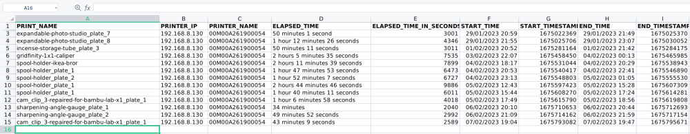
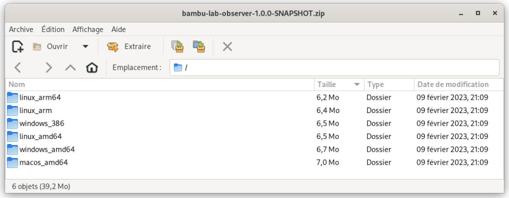

# bambu-lab-observer

IN PROGRESS

`bambu-lab-observer` is a small program receiving events sent by Bambu Lab printers over MQTT, and continuously building a .CSV file listing all printed item with timings spent on each print.

Example of generated .CSV file : 



## Download and installation

### Download

Just grab the latest (pre-)release (you need to be logged into GITHUB to see pre-releases) : 
- `1.0.0-SNAPSHOT` is only working for old firmwares < 1.06.00 (2023-08-04)
- `1.0.1-SNAPSHOT` is working for newer firmwares >= 1.06.00 (2023-08-04)

### Installation

- Pick-up the proper binary related to your hardware (regular PC (intel/amd x86) = `amd64`, raspberry pi = `arm`, ...) from the downloaded archive
  
- Setup the configuration file (see next chapter)
- Just launch the tool through `bambu-lab-observer` / `bambu-lab-observer.exe`

## Configuration

### Configuration file

Minimal configuration (with mandatory fields) is (for recent firmwares) :

```json
{
    "BambuLabPrinters" : 
        [ 
            { 
                "IP" : "192.168.8.130",  
                "MQTTUsername" : "bblp", 
                "MQTTPassword": "XXXXXXXXX",
                "MQTTTLS" : true
            }
        ]
}
```

Full configuration, for several printers (showing all possible fields - any combinations of fields is possible : no need to define everything, see table below for default values for unconfigured fields) : 

```json
{
    "BambuLabPrinters" : 
        [ 
            { 
                "IP" : "192.168.8.130",  
                "MQTTUsername" : "bblp", 
                "MQTTPassword": "XXXXXXXXX",
                "MQTTTLS" : true
            },
            { 
                "IP" : "192.168.8.131",  
                "MQTTUsername" : "bblp", 
                "MQTTPassword": "YYYYYYYY",
                "MQTTTLS" : true
            },
            { 
                "IP" : "192.168.8.132",
                "MQTTTLS" : false
            },
            { 
                "IP" : "192.168.8.133",
                "MQTTTLS" : false,
                "Disabled" : true
            },
        ],
    "CSVFileName" : "bambu-lab-observer.csv",
    "LogLevel" : "INFO",
    "Topics" : [ "device/+/report" ],
    "MQTTQoS" : 0,
    "PolicyAboutRegisterStartOfPrint" : "FIRST_MESSAGE_TIMESTAMP"
}
```

### Available fields

Details of configuration fields :

| Field                              | Mandatory | Default value             | Explanations                                                                |
|------------------------------------|-----------|---------------------------|-----------------------------------------------------------------------------|
| `BambuLabPrinters`                 | **YES**  | -                         | Array of printers addresses that need to be monitored (see example just before).                     |
| `CSVFileName`                      | NO  | `bambu-lab-observer.csv`  | Name (and path if needed) of the CSV file in which the prints are going to be reported                    |
| `LogLevel`                         | NO  | INFO                      | Log levels. Possible values : `DEBUG`, `INFO`, `WARN`, `ERROR` , `NONE`     |
| `Topics`                           | NO  | `device/+/report`         | Array of topics to be monitored. `+` means "any value". Example : `[ "#" ]` (all topics), or `[ "device/<AMD_ID_1>/report", "device/<AMD_ID_2>/report" ]`                    |
| `MQTTQoS`                          | NO  | `0`                       | Default value for MQTT QoS. `0` should be fine, keep in mind that higher values may have side  effects on the MQTT server located inside the printer (as messages will be buffered there in case of the network being down, and so on)                    |
| `PolicyAboutRegisterStartOfPrint`  | NO  | `FIRST_MESSAGE_TIMESTAMP` | Policy about "how to track the beginning of one print. Either `FIRST_MESSAGE_TIMESTAMP` : beginning will be after the first MQTT message is sent by the printer (but if you stop and restart the program during the print, the counting will restart at 0), either `GCODE_START_TIMESTAMP`, which means the start time will be extracted from the GCODE information sent by the printer (in this case, you can restart the program during the print, BUT it may be inaccurate as it will be the time at which you hitted "print" in Bambu Studio)                    |

For each printer : 

| Field                       | Mandatory | Default value             | Explanations                                                                |
|-----------------------------|-----------|---------------------------|-----------------------------------------------------------------------------|
| `IP`                        | **YES**   | -                         | Check your router, or the network panel of the settings on the Bambu screen |
| `MQTTUsername`              | NO        | `bblp`                    | At this time all Bambu Lab printers have that `bblp` default username. This field is only needed if `TLS` is set to `true` (in which case that username has to be entered)              |
| `MQTTPassword`              | NO        | -                         | Since X1C firmware `01.04.00.00 (20230207)`, secured auth is required to access the X1C MQTT server, hence `TLS` to be activated (see next parameter) and `MQTTPassword` to be provided. You can find / reset the password in the Network settings of the printer (just below the `LAN mode` feature). This field is only needed if `TLS` is set to `true`  |
| `MQTTTLS`                   | **YES**   | -                         | Now activated by default, see previous point                                             |
| `Disabled`                  | No        | `false`                   | May be used to temporarily skip one printer without removing its configuration                                             |
| `Comment`                   | No        | -                         | Not used but may allow to add any string inside the configuration of one printer                   |


## TODO 

- [ ] Push/publish the source code (currently under stabilization)
- [ ] Try to monitor the amount of filament used for each part
- [ ] Add some notifications mechanizms through rules
- [ ] Build in some way (.JS, XLS, ...) a simple reporting with some graphs (number of prints over the weeks, running times, ...)
